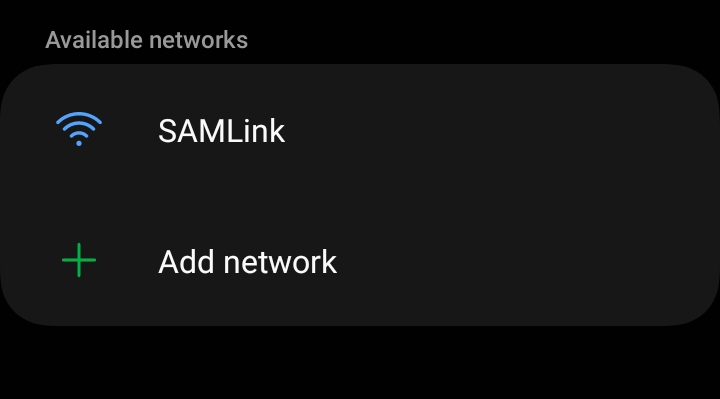
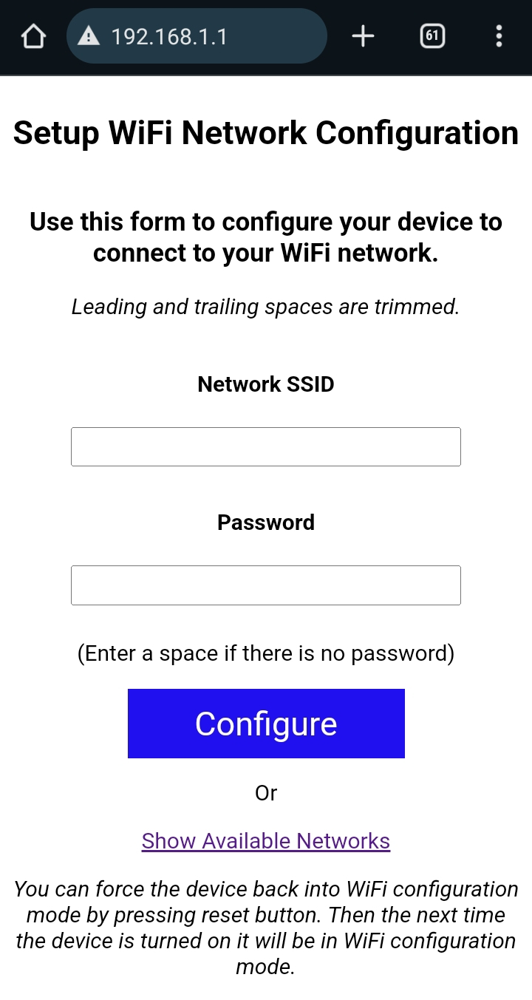
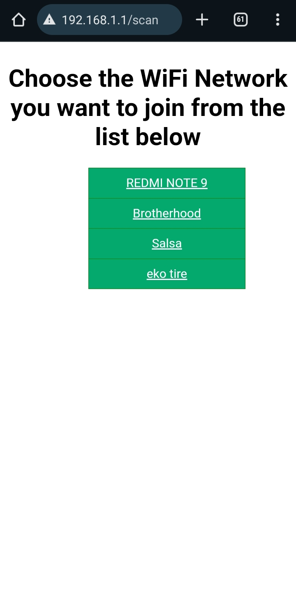

# Connect to Internet

## Build, Flash and Monitor

Setelah selesai dengan tahapan sebelumnya, Build Project dan Flash Device untuk mengunggah kode sebelumnya ke perangkat elektronik.

Anda dapat melakukan Monitor Device dan melihat bahwa library berhasil ditambahkan dan berjalan dengan semestinya.

<figure><figcaption></figcaption></figure>

Pantau aktivitas perangkat melalui menu Monitor Device. Pada awal mula dijalankan, perangkat akan berada dalam mode access point. Pada output terminal Anda dapat melihat status seperti ini.

<pre><code><strong># Console Output
</strong><strong>
</strong><strong>Number of Access Points Found: 5
</strong>
               SSID              | Channel | RSSI
***************************************************************
                     Brotherhood |       1 |  -80
                    REDMI NOTE 9 |       3 |  -82
                        eko tire |      11 |  -91
                           HILMA |       1 |  -93
                           LUBNA |       5 |  -94
***************************************************************
</code></pre>

Pada tahap ini Anda juga memerlukan perangkat lain seperti smartphone, laptop maupun PC untuk terhubung ke device tersebut dan mengkonfigurasi SSID dan Password dari WiFi terdekat dari device.&#x20;

<figure><figcaption></figcaption></figure>

Buka daftar jaringan yang terdeteksi pada perangkat WiFi laptop maupun smartphone, maka akan terlihat sebuah access point dengan nama SAMLink. Nama access point ini nantinya juga dapat Anda ganti melalui konfigurasi library.

## Open Browser

Setelah terhubung ke jaringan **SAMLink**, buka browser lalu ketikkan **192.168.1.1**. Maka akan muncul halaman seperti ini.

<div><figure><figcaption></figcaption></figure> <figure><figcaption></figcaption></figure></div>

Isi dengan SSID dan Password dari jaringan Anda lalu tekan Configure untuk menyimpan konfigurasi tersebut ke device. Anda juga dapat melihat jaringan sekitar yang terdekat dengan perangkat Anda melalui menu Show Available Networks.&#x20;

Periksa console monitor device Anda. Device akan berusaha terhubung ke akses poin yang sebelumnya sudah disimpan. Setelah itu, device mendaftarkan diri ke platform IoT SAM Element sebagai perangkat baru. Jika berhasil maka akan muncul teks seperti berikut.

```
# Console Output

Summary of your device

                Serial Number |         Project |          Model | Nodes | Properties    
**************************************************************************************
               1SCCDBA79B7988 |     Smart Relay |      SAM-SMR01 |     0 |    0
**************************************************************************************
```

## Devices List

Periksa apakah device dengan serial number yang tertera pada console sudah berhasil tampil dalam daftar perangkat pada akun Developer Anda. Buka [Developer Dashboard](https://dev.samelement.com:8888/) lalu masuk ke menu Devices.&#x20;

<figure><figcaption></figcaption></figure>

Selamat! Kini perangkat Anda sekarang sudah terhubung ke Internet dan platform IoT SAM Element.

## SAM IoT

SAM IoT merupakan aplikasi smartphone berbasis Android yang dapat diunduh langsung melalui Google Play Store. Aplikasi ini membantu pengembang untuk berinteraksi maupun memonitor data yang dikirimkan oleh device. Untuk memulai berinteraksi dengan device, terlebih dahulu Anda harus mengklaim device tersebut yang menjadikan Anda sebagai owner device.&#x20;

Lakukan pencarian device melalui menu Add Device pada aplikasi SAM IoT.

<div><figure><figcaption></figcaption></figure> <figure><figcaption></figcaption></figure></div>
